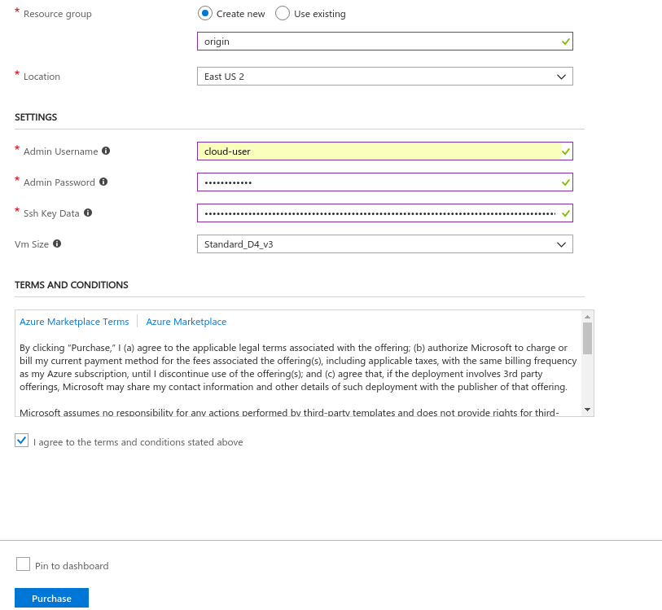
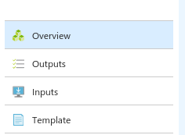

# Eclipse MicroProfile (WildFly Swarm) on Azure

**NOTE: Use Chrome or Firefox for the instructions below. They will not work with Safari**

Congratulations! You have just received your free Azure trial pass to try Eclipse MicroProfile on Azure.

Follow these instructions to set up and run MicroProfile (Thorntail) on OpenShift on Azure:

1. Open a browser and navigate to: www.microsoftazurepass.com and click on the "Start" button

2. On the following screen, enter your Microsoft account credential, e.g. hotmail email or Skype email or LinkedIn email:

3. Then enter your corresponding password:

4. If the next "Updating Terms" screen is displayed, just click on the "Next" button:

5. Then click on the button for your preference to stay signed in or not:

6. On this screen, click on the "Confirm Microsoft account" button

7. Enter your Promo Code from your Azure trial pass and click on "Claim your Promo Code" button:

8. Once your Azure trial pass Promo Code is accepted, click on the "Activate" button:

9. Follow these sub-steps to create an all-in-one OpenShift Origin cluster:
#### Create a Single VM Origin deployment using the Azure Portal
Please ensure that an account has already been configured before clicking the button below.

------

This template deploys OpenShift Origin on Azure.

#### Subscription
Accept the default subscription ID value. Note: this field is not shown in the picture above.

#### Resource Group
Select "Create new" resource group if one does not currently exist.

#### Location
The geographic location in which to deploy OpenShift Origin.

#### Admin User
Supply a username which will be used for both SSH access and for the OpenShift Origin web console.

#### Admin Password
Supply a password which will be used for the Origin web console.

#### Ssh Key Data
You will need a SSH RSA public key for access if one currently does not exist on your system. Please supply your Public SSH key only. 
For example, in Linux the key can be located at ~/.ssh/id_rsa.pub

##### SSH Key Generation (Optiona)

1. [Windows](ssh_windows.md)
2. [Linux](ssh_linux.md)
3. [Mac](ssh_mac.md)

#### Vm Size
Specify a VM size. A default value is provided. If another size or type of vm is required ensure that the Location contains that instance type.

Once all of these values are set, then check the box to "Agree to the terms and conditions" and then click the Purchase button.

#### Deployment
A notification will pop up in the top right notifying you of the deployment. Click the notifications icon and then click "Deployment in progress...". The deployment will take 15-20 minutes. Once completed select "Outputs" to receive the URL of the OpenShift Origin console and SSH information.

#### Thanks to the following individuals for the base template:
Daniel Falkner
Glenn West
Harold Wong
Ivan McKinley
